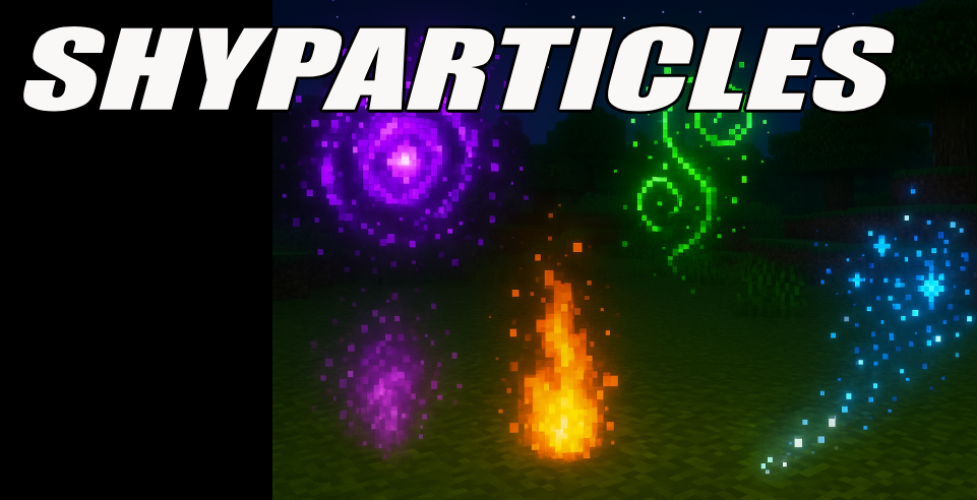

# ShyParticles

ShyParticles is a modern, high-performance particle effects plugin for Bukkit and Folia based Minecraft servers. It provides stunning visual effects with extensive customization options and easy-to-use commands for creating immersive particle displays.

## ✨ Key Features

### Core Features
* **🚀 Performance Optimized**: Fully asynchronous processing
* **🎆 Stunning Visual Effects**: Beautiful particle displays with smooth animations
* **🎨 Rich Customization**: Extensive configuration options for each effect
* **📏 Multiple Effect Types**: Various pre-built effects and custom configuration support

### Effect Types
* **🌀 Follow Effects**: Particles that follow players around
* **📍 Location Effects**: Static particle effects at specific locations

### Pre-built Effects
* **🔵 Blue Sphere**: Elegant spinning blue particle sphere
* **📦 Box Tower**: Towering particle structure effect
* **🌸 Cherry Blossom Wind**: Gentle falling cherry blossom particles
* **💃 Dancing Circles**: Animated circular particle patterns
* **⚡ Electric Storm**: Dynamic electrical particle effects
* **🌟 Enchanting Portal**: Mystical portal-like particle effect
* **🔥 Flame Tornado**: Spiraling fire particle tornado
* **🪐 Orbital Rings**: Planetary ring particle system
* **❤️ Pulsing Heart**: Romantic heart-shaped particle effect
* **🌈 Rainbow Spiral**: Colorful spiraling particle display
* **👻 Soul Vortex**: Mysterious swirling soul particles
* **⭐ Yellow Star**: Bright star-shaped particle effect

### Compatibility
* **📦 Server Support**: Bukkit and Folia compatible
* **🔌 Plugin Integration**: PlaceholderAPI support for dynamic content

## 🚀 Quick Start

### 1. Installation
1. Download the latest ShyParticles plugin JAR
2. Place it in your server's `plugins/` folder
3. Restart your server

### 2. Basic Setup
1. Navigate to `/plugins/ShyParticles/effects/`
2. Edit existing effect files or create new ones to customize particle effects
3. Run `/shyparticles reload` to apply changes

### 3. Using Effects
* **Start a follow effect**: `/shyparticles follow <effect_name>`
* **Play an effect at location**: `/shyparticles play <effect_name>`
* **Stop effects**: `/shyparticles stop` or `/shyparticles stopfollow`

## 📚 Documentation

* **[Configuration Guide](installation.md)** - Step-by-step setup instructions
* **[Commands Reference](commands.md)** - Complete command documentation
* **[Permissions](permission.md)** - Permission nodes and access levels

## 💡 Example Use Cases

* **Server Hubs**: Create welcoming particle effects and visual displays
* **Events & Celebrations**: Add festive particle effects for special occasions
* **RPG Servers**: Enhance magical spells and abilities with particle effects
* **Adventure Maps**: Create atmospheric effects and visual storytelling elements
* **PvP Arenas**: Add dynamic visual effects to enhance combat areas
* **Building Contests**: Provide decorative particle effects for showcase builds

## 🤝 Need Help?

If you need assistance setting up ShyParticles, check out our detailed configuration guide or review the sample effect files included with the plugin.
